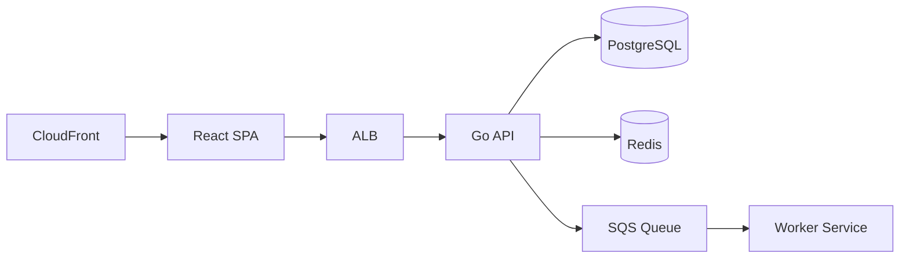

# Project Phoenix — E-Commerce Redesign

**Author**: Product Team
**Date**: 2025-01-15
**Version**: 1.0

## 1. Overview

Redesign the e-commerce platform with a new React frontend and Go backend. The system must handle 10,000 concurrent users and achieve sub-second page loads.

## 2. Frontend Requirements

### 2.1 Product Listing Page

- Implement responsive grid layout using React + Tailwind CSS
- Support filtering by category, price range, and brand
- Lazy load images with intersection observer
- Must support mobile, tablet, and desktop breakpoints

### 2.2 Checkout Flow

- Multi-step form with client-side validation
- Integrate Stripe payment widget for card processing
- Real-time inventory check via WebSocket connection
- Display order summary with tax calculation

## 3. Backend API

### 3.1 Product Service

- REST API: GET /api/v1/products with pagination and filtering
- REST API: POST /api/v1/products for admin product creation
- PostgreSQL database with read replicas for high availability
- Redis cache with 5-minute TTL for product listings

### 3.2 Order Service

- Event-driven architecture: order.created → inventory.reserved → payment.processed
- Saga pattern for distributed transactions with compensation logic
- Webhook notifications to merchants on order status changes

## 4. Infrastructure

- Deploy on AWS EKS with 3 node groups: frontend, backend, data
- Terraform for all Infrastructure as Code
- CloudFront CDN for static assets and image delivery
- RDS PostgreSQL Multi-AZ for database high availability
- ElastiCache Redis cluster for caching layer

## 5. Security Requirements

- JWT-based authentication with refresh token rotation
- Rate limiting: 100 requests per minute per authenticated user
- PCI-DSS compliance for the payment processing flow
- All data encrypted at rest and in transit using TLS 1.3

## 6. Architecture

## 7. Timeline

- Phase 1 (Weeks 1-4): Backend API and database setup
- Phase 2 (Weeks 3-6): Frontend implementation
- Phase 3 (Weeks 5-8): Infrastructure provisioning and security hardening
- Phase 4 (Weeks 7-8): Integration testing and launch preparation
