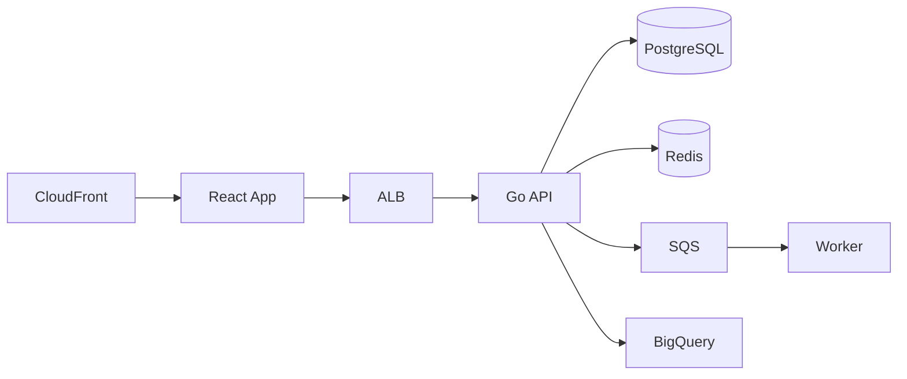

# Enterprise Platform Redesign

**Author**: Engineering Team
**Date**: 2025-03-01
**Version**: 2.0

## 1. Overview

Build a comprehensive enterprise platform with React frontend, Go backend, and Kubernetes infrastructure. The system must handle 50,000 concurrent users.

## 2. Frontend Requirements

### 2.1 Dashboard

- Build responsive dashboard with React and Tailwind CSS
- Real-time data updates via WebSocket
- Must support dark mode and accessibility (WCAG 2.1 AA)

### 2.2 User Management

- Multi-step registration form with client-side validation
- Profile editing with image upload
- Role-based UI rendering

## 3. Backend Services

### 3.1 User Service

- REST API: GET /api/v1/users with pagination
- REST API: POST /api/v1/users for registration
- REST API: PUT /api/v1/users/:id for profile updates
- PostgreSQL with read replicas
- Redis cache with 10-minute TTL

### 3.2 Notification Service

- Event-driven: user.created → welcome.email → onboarding.started
- Queue-based processing with SQS
- Webhook delivery with retry logic

### 3.3 Analytics Service

- Data pipeline for user behavior tracking
- ETL process for daily aggregations
- BigQuery data warehouse for analytics

## 4. Infrastructure

- AWS EKS cluster with 3 node groups
- Terraform for all Infrastructure as Code
- CloudFront CDN for static assets
- RDS PostgreSQL Multi-AZ deployment
- ElastiCache Redis cluster

## 5. CI/CD Pipeline

- GitHub Actions for CI/CD pipeline
- Canary deployments with ArgoCD
- Prometheus monitoring with Grafana dashboards
- PagerDuty alerting for SLA violations

## 6. Security

- JWT authentication with refresh token rotation
- Rate limiting: 200 requests per minute per user
- SOC2 compliance audit trail
- All data encrypted at rest with KMS
- WAF protection against DDoS

## 7. Shared Contracts

- OpenAPI specification for all REST endpoints
- Protobuf definitions for internal service communication
- Shared error codes and status codes

## 8. Architecture

## 9. Timeline

- Phase 1 (Weeks 1-4): Backend services and database
- Phase 2 (Weeks 3-8): Frontend implementation
- Phase 3 (Weeks 5-10): Infrastructure and CI/CD
- Phase 4 (Weeks 8-12): Security hardening and launch
